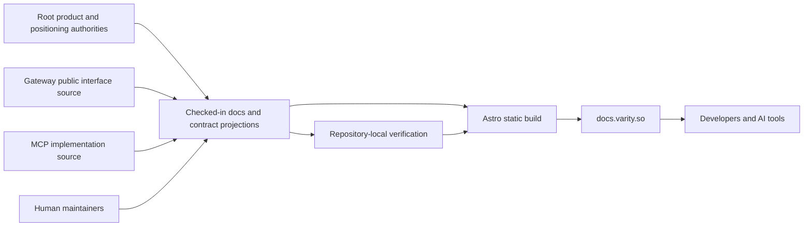

# Varity Documentation Architecture

Status: current repository architecture
Last code-grounded audit: 2026-07-18

This document is the repository-level architecture layer for
`varity-docs`. The workspace-level system map owns cross-repository runtime
relationships. This file owns how public documentation and machine-readable
artifacts are authored, verified, and published.

## Context and responsibility

`varity-docs` is a static publishing surface. Developers and AI tools consume
content from `docs.varity.so`; maintainers author checked-in content and GitHub
Actions verifies the repository before the hosting platform publishes the
static build.

The repository owns:

- public product documentation and navigation;
- the public OpenAPI projection;
- the public MCP tool-catalog projection;
- LLM-readable summary and full-context projections;
- static-site composition, metadata, redirects, and public assets;
- deterministic repository-local documentation verification.

It does not own shipped capability, pricing values, authentication, deployment
execution, durable state, the MCP implementation, or the public gateway
implementation.



The arrows from runtime repositories are semantic provenance, not runtime
calls. The built site does not depend on those repositories or their secrets.

## Modules and interfaces

### Human documentation module

- **Interface:** routable pages, frontmatter, links, examples, user-visible
  terminology, and navigation configured in `astro.config.mjs`.
- **Implementation:** `src/content/docs/`, `src/components/`, `src/styles/`,
  `src/assets/`, `src/content.config.ts`, and `astro.config.mjs`.
- **Seam:** Astro's content loader and static route generation.
- **Test surface:** Astro type checking/build, positioning checks, link review,
  and local browser verification.

### Machine-readable publication module

- **Interface:** stable public URLs `/openapi.yaml`, `/mcp-schema.json`,
  `/llms.txt`, and `/llms-full.txt`.
- **Implementation:** checked-in files under `public/` which Astro copies into
  `dist/` without transformation.
- **Seam:** static public-file publication.
- **Test surface:** `tests/test-contract-artifacts.cjs`, followed by the Astro
  build and `npm run test:built-contracts`.

This module intentionally makes no generation claim. The four artifacts are
checked-in projections and must be reconciled manually from their narrower
authorities in the same pull request. A future generator is acceptable only if
its source and deterministic verification are checked in with it.

### Verification module

- **Interface:** `npm test` for deterministic repository tests and
  `npm run check` for the complete merge check.
- **Implementation:** `tests/test-contract-artifacts.cjs`,
  `tests/test-positioning-static.cjs`,
  `tests/test-architecture-governance.cjs`, package scripts, and
  `.github/workflows/test-docs.yml`.
- **Seam:** process exit status in local development and GitHub Actions.
- **Test surface:** the same commands maintainers and CI run.

The older `tests/test-docs.cjs` live crawler is outside this interface. It is
network-dependent, refers to retired product surfaces, and is retained only as
historical diagnostic material until a separate cleanup change proves which
checks should be ported or deleted.

## Content and artifact provenance

| Published surface | Checked-in owner | Narrower authority to reconcile | Required verification |
|---|---|---|---|
| Human pages | `src/content/docs/` | Workspace manifest, positioning, pricing, security, and current public behavior | `npm run check` plus browser review when visual/navigation behavior changes |
| OpenAPI | `public/openapi.yaml` | Gateway-owned public platform interface and its current implementation tests | JSON/OpenAPI structure, internal references, unique operation IDs, API-reference link, build copy |
| MCP catalog | `public/mcp-schema.json` | Canonical `@varity-labs/mcp` implementation and published package contract | JSON/schema structure, tool-count/name uniqueness, reference-page links, build copy |
| LLM summary | `public/llms.txt` | Current public pages and supported product claims | Required identity/artifact links, no placeholder content, build copy |
| LLM full context | `public/llms-full.txt` | Current public pages and supported product claims | Required identity/artifact links, nontrivial full-content size, build copy |
| Redirects and static assets | `public/` | Current hosting behavior and brand assets | Redirect invariant, Astro build, visual review where applicable |

The contract projections are public documentation artifacts. They must not
contain infrastructure credentials, private provider details, internal
orchestration logic, customer data, or claims that exceed the shipped product.

## Build and publication flow

```text
source content + components + public artifacts
  -> npm test
     -> architecture governance
     -> contract projection conformance
     -> positioning guardrails
  -> npm run lint
  -> npm run build
  -> dist/
  -> verify unchanged built contract copies
  -> static hosting release
```

`dist/`, `.astro/`, and `node_modules/` are generated and never authoritative.
The repository CI uses only `contents: read`, checks out no private repository,
and requires no production credential.

## Failure semantics

- A malformed or internally inconsistent contract projection fails `npm test`.
- A high-severity public terminology violation fails `npm test`.
- A missing architecture declaration fails pull-request CI, but local and push
  runs still validate the required architecture files.
- An Astro type or rendering error fails lint/build.
- External-link availability is not a deterministic merge assertion. Verify
  relevant external links during review or a separately governed scheduled
  check.
- A green static build does not prove that product claims match live behavior.
  The author must reconcile the narrower product authority before editing.

## Change navigation

| Change | Inspect and update together |
|---|---|
| Public deployment field or route | Gateway interface, OpenAPI, API reference, affected guides, MCP/CLI/portal consumers outside this repo |
| MCP tool name or input/output contract | MCP implementation, MCP catalog, MCP reference, LLM artifacts |
| Supported capability | Workspace manifest and gate evidence first, then affected pages and LLM artifacts |
| Pricing language | Root pricing/positioning authority, affected pages and LLM artifacts; never hardcode live values |
| Page or information architecture | Page source, `astro.config.mjs`, links, metadata, sitemap behavior, local responsive review |
| Publishing topology or artifact provenance | This file, CI/workflows, pull-request architecture declaration, and a workspace ADR when load-bearing |

## Security and privacy

- The static site holds no runtime secret and repository CI has no private
  checkout token.
- All content in this public repository must be safe for public disclosure.
- Examples use environment-variable names and non-secret sample values only.
- Public interface documentation must stay provider-neutral and must not expose
  proprietary orchestration logic.
- Security incidents and sensitive reports follow `SECURITY.md`, not public
  issues or documentation pages.
